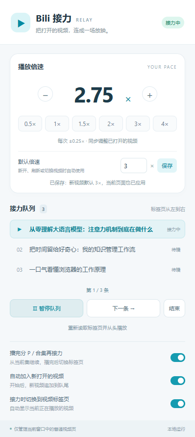

<div align="center">


# Bili 接力 · Bili Relay

**把打开的视频，连成一场放映。**

为 Chrome / Edge 打造的哔哩哔哩倍速与跨标签页顺序播放扩展。

自定义倍速 · 多标签页接力 · 可拖动浮窗 · 本地运行

[安装](#安装) · [使用](#使用) · [常见问题](#常见问题) · [参与开发](#参与开发)

</div>

你是否也会一次打开十几个 B 站视频，然后每看完一个，就手动切到下一个？

Bili 接力会把当前窗口的视频标签页按从左到右的顺序组成队列。默认先播完当前视频剩余的分 P 和所在合集的后续视频，再自动切换到下一个标签页。你也可以设置默认倍速，用浮窗一键切到 **2× / 3×**，或每次 **±0.25×** 微调。

## 功能

| 功能 | 说明 |
| --- | --- |
| 分 P / 合集续播 | 从当前 P / 当前集往后播放，全部播完再切换标签页，可关闭 |
| 跨标签页接力 | 按标签页从左到右播放，自动暂停队列中的其他视频 |
| 自定义倍速 | 支持 **0.0625～16×**，可精确输入，例如 `1.25`、`2.75` |
| 快捷调速 | 浮窗提供 **2× / 3×**，并保留每次 **±0.25×** 的按钮 |
| 默认倍速 | 保存常用速度，新开、刷新或切换视频时自动应用 |
| 紧凑浮窗 | 小尺寸倍速控件、前后视频箭头，状态圆点悬停查看详情 |
| 可拖动浮窗 | 拖动左侧手柄移动，记住位置，支持收起和双击复位 |
| 队列控制 | 暂停、继续、跳过，或直接点击队列中的某条视频 |
| 自动追加 | 播放期间新打开的同窗口视频，可自动加入队尾 |
| 关闭后接力 | 关闭当前播放标签页，自动播放下一条；关闭待播页会移出队列 |
| 本地存储 | 无需扩展账号或服务端，不上传视频列表与设置 |

## 界面预览

扩展弹窗：设置倍速、管理接力队列。



页面浮窗：紧凑调速、前后视频切换，也可以拖动到顺手的位置。


> 截图来自本地演示环境，视频标题为示例；浮窗会根据窗口宽度自动换行。

## 安装

支持桌面版 **Chrome / Microsoft Edge**。扩展采用 Manifest V3，源码可直接加载，**使用时无需安装 Node.js，也无需构建**。

1. 下载仓库源码并解压。在 GitHub 仓库页面可点击 **Code → Download ZIP**。
2. 打开浏览器的扩展管理页：Chrome 为 `chrome://extensions`，Edge 为 `edge://extensions`。
3. 开启 **开发者模式**，点击 **加载已解压的扩展程序**。
4. 选择包含 `manifest.json` 的项目文件夹。
5. 在浏览器扩展菜单中，将 **Bili 接力** 固定到工具栏。
6. 刷新已经打开的 B 站视频页，让页面加载最新的浮窗控件。

**更新扩展：**替换本地文件后，在扩展管理页点击本扩展的「重新加载」，再刷新视频页面。保留原扩展安装即可保留本地设置。

## 使用

### 让多个视频依次播放

1. 在同一个浏览器窗口打开多个 B 站视频标签页。
2. 按想看的顺序，从左到右排列标签页。
3. 点击工具栏上的 **Bili 接力 → 开始顺序播放**。

插件从最左侧的视频开始，暂停队列里的其他视频。默认从当前 P / 当前集往后播完分 P 和合集，再接力到下一个标签页；整个队列结束后停止。默认会切换到正在播放的标签页，也可关闭这一设置。

- 「播完分 P / 合集再接力」默认开启：先播放同一视频的下一 P，再按合集列表顺序播放后续视频；不会回到合集第一条。关闭后，当前 P 结束就切换到下一个标签页。
- 浮窗的 **← / →** 切换接力队列中的前一个 / 后一个视频标签页；切换后立即播放，其他队列视频暂停。未开始队列或到达首尾时，对应箭头置灰。箭头与弹窗「下一条」一样按标签页切换。
- 「下一条」会跳过当前标签页剩余的分 P / 合集，直接播放下一个队列标签页。队列按标签页管理，不会将合集每一集展开成独立队列项。
- 分 P / 合集信息读取或跳转失败时显示重试提示；点击浮窗「继续播放」或弹窗「继续队列」重试，也可点击「下一条」跳过。
- 视频从现有播放位置继续；已播放结束的视频从头播放。
- 默认将同一窗口中新打开的视频追加到队尾，可关闭「自动加入新打开的视频」。
- 开始后的队列顺序固定。拖动浏览器标签页不会改变队列；需要重新排序时，点击「重新读取标签页并从头播放」。这里的「从头」指从队列第一条开始，不会统一重置视频进度。
- 暂停当前播放器也会暂停队列；再次点击当前播放器的播放按钮、浮窗的「继续播放」，或扩展中的「继续队列」均可恢复。其他视频保持暂停；如果手动播放另一条队列视频，接力会切换到那一条。
- 点击「结束」会暂停队列视频并解除队列管理，之后可自由操作播放器。
- 标签页加载或暂时缺少地址信息时会保留队列项；关闭页面或确认离开视频页后才会移除。未开始播放时，弹窗中的视频预览会随标签页变化刷新。

### 设置倍速

| 操作 | 效果 |
| --- | --- |
| 点击浮窗 `2×` / `3×` | 立即切换为对应速度，当前预设会高亮 |
| 点击 `−` / `+` | 每次减 / 加 `0.25×`，达到支持范围边界后停止变化 |
| 直接输入倍速 | 使用任意有效值，例如 `1.2`、`2.75`、`5` |
| 设置「默认倍速」并保存 | 立即应用到已打开的视频，后续新开、刷新或切换视频时自动使用 |

当前倍速调整会同步应用到**所有已打开的普通 B 站视频页，包括其他窗口中的视频页**。播放队列则只管理开始时所选窗口中的视频。

浮窗调速会立即应用到当前视频，其他页面随后同步；当前视频的暂停 / 继续也不会等待后台标签页的回复。连续点击会保留每次调整，较晚到达的旧同步消息不会覆盖新状态。

临时调整不会覆盖默认倍速。例如：默认设为 **2×**，当前点击 `+` 调到 **2.25×**，新打开的视频仍会使用 **2×**。

浮窗中的状态圆点表示当前状态，鼠标悬停可查看完整提示；需要继续播放或重试时，会显示操作按钮。

### 移动浮窗

- 按住浮窗左侧的 **⠿ 拖动手柄** 移动，展开或收起状态都可以移动。
- 位置会保存在本地，刷新或新打开视频后自动恢复。
- 窗口缩小时，浮窗会限制在可见区域内。
- **双击拖动手柄**恢复到默认右下角位置。
- 用 Tab 聚焦拖动手柄后，可用方向键移动；按住 Shift 可进行更精细的移动。

## 常见问题

### 支持哪些 B 站页面？

目前支持桌面站的普通视频页：

```text
https://www.bilibili.com/video/BV…
https://www.bilibili.com/video/av…
```

直播、番剧 / 影视播放页及移动站页面暂不支持。普通视频的分 P 和视频页关联的 UGC 合集支持顺序续播；个人收藏夹、稍后再看、空间播放列表暂不作为合集展开。

### 为什么下一条视频没有自动播放？

浏览器可能拦截未经交互的有声自动播放。出现提示时，点击浮窗上的 **继续播放**，或点击 B 站播放器的播放按钮。

登录状态、视频访问权限、网络异常以及浏览器节能策略也可能影响播放。建议保留「接力时切换到视频标签页」，并确认目标视频可以正常播放。

### 会与 B 站自己的自动连播冲突吗？

建议关闭 B 站自身的「自动连播 / 自动切集」。扩展会拦截标准播放器的结束事件，并在队列管理期间临时关闭单视频循环；结束队列后恢复原循环设置。B 站播放器后续更新仍可能影响兼容性。

### 能跳过没播完的视频，直接播放后面的视频吗？

可以。在另一条队列视频的播放器中手动点击播放（也支持播放快捷键），或点击该页浮窗的「播放此条」，即可把接力切换到这一条。原视频会暂停，不必先播完；即使队列处于暂停状态，也能直接切换并播放。选中的视频播完后，会继续它后面的队列。

仅切换浏览器标签页不会改变队列；后台页面自行触发的自动播放仍会被暂停，避免抢占接力。如果播放器按钮未被识别，可以使用浮窗「播放此条」或在扩展弹窗的队列中点击该视频。

### 关闭弹窗或重启浏览器后会怎样？

关闭扩展弹窗不会停止接力。每次只运行一个队列，开始新队列会替换旧队列。

浏览器重启后保留默认倍速与浮窗位置，但不会自动恢复播放，需要重新开始队列。电脑休眠或浏览器关闭时也不会继续播放。

## 权限与隐私

扩展不使用自建服务器或统计脚本。开启分 P / 合集续播时，会向 B 站公开视频信息接口发送当前视频的 BV / av 编号，以读取分 P 和合集顺序；请求不携带登录凭据。队列中的视频标题、地址、标签页标识，以及倍速和浮窗位置，仅保存在浏览器本地。视频仍由 B 站页面正常加载与播放。

| 权限 | 用途 |
| --- | --- |
| `storage` | 保存队列状态、默认倍速和浮窗位置 |
| `scripting` | 向安装前已经打开的 B 站页面注入控件与播放控制脚本 |
| `https://www.bilibili.com/*` | 识别和控制 B 站桌面页面中的播放器 |
| `https://api.bilibili.com/*` | 读取当前视频的公开分 P 和合集信息，用于顺序续播 |

## 参与开发

项目使用原生 JavaScript、HTML、CSS 和 Chrome Extension API，无构建步骤。运行基础检查需要 **Node.js 20 或更新版本**。

### 项目结构

```text
.
├── manifest.json           # 扩展配置与权限
├── background.js           # 队列调度、标签页事件和本地状态
├── content.js              # 播放器控制、倍速浮窗和拖动
├── core.js                 # 视频识别、队列排序和播放策略
├── sequence.js             # 分 P / 合集顺序与公开视频信息读取
├── popup.html              # 扩展弹窗
├── popup.css
├── popup.js
├── icons/                  # 扩展图标
├── docs/images/            # README 演示截图
├── tests/                  # 核心逻辑与后台调度测试
└── tools/                  # 浏览器交互及暂停恢复联动检查
```

### 基础检查

在项目根目录执行，无需额外安装依赖：

```sh
npm test
npm run check
```

测试使用 Node.js 内置测试框架和模拟的扩展 API，覆盖队列推进、重复结束事件、关闭标签页、暂停恢复、默认倍速、连续调速、设置迁移、分 P / 合集续播、读取失败重试及切换期间的暂停 / 跳过。

### 浏览器交互检查

安装可选的 Playwright 驱动后，使用本机 Chrome / Edge：

```sh
npm install --no-save playwright-core
node tools/browser-smoke.mjs
node tools/pause-resume-smoke.mjs
```

默认使用 Windows 标准安装路径下的 Chrome。其他路径或操作系统可通过 `BROWSER_PATH` 指定浏览器，例如在 PowerShell 中使用 Edge：

```powershell
$env:BROWSER_PATH = 'C:\Program Files (x86)\Microsoft\Edge\Application\msedge.exe'
node tools/browser-smoke.mjs
```

检查使用独立的无头浏览器、模拟页面和本地媒体，不读取个人浏览器数据。它会验证弹窗交互、原生媒体结束事件、浮窗拖动、位置恢复和窗口边界，截图输出到 `artifacts/`。这些检查不代替真实 B 站页面的兼容性验证。

`pause-resume-smoke.mjs` 会将实际后台调度脚本与两个浏览器页面的实际内容脚本联动运行，验证播放器暂停后恢复、浮窗继续、连续暂停 / 继续、后台自动播放保持暂停、手动鼠标 / 键盘播放待播页时转移接力、浮窗选择视频，以及恢复后从 P1 到 P2、合集下一集、信息读取失败后重试，最终切到下一标签页。

### 提交反馈或改进

欢迎提交 Issue 和 Pull Request。反馈问题时，请尽量提供：

- 浏览器名称、版本，以及扩展版本。
- 视频页面类型：普通视频、分 P 等。
- 复现步骤、预期行为和实际结果。
- 相关截图或扩展错误信息；分享前请隐藏个人信息。

提交代码前请运行基础检查。涉及播放器、自动播放或标签页切换的修改，也请在真实 B 站页面验证。

## 项目说明

Bili 接力是独立开发的浏览器扩展，与哔哩哔哩官方无关联。
